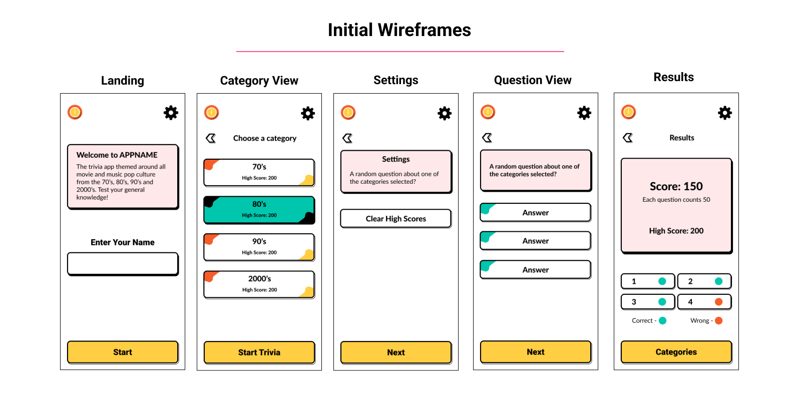
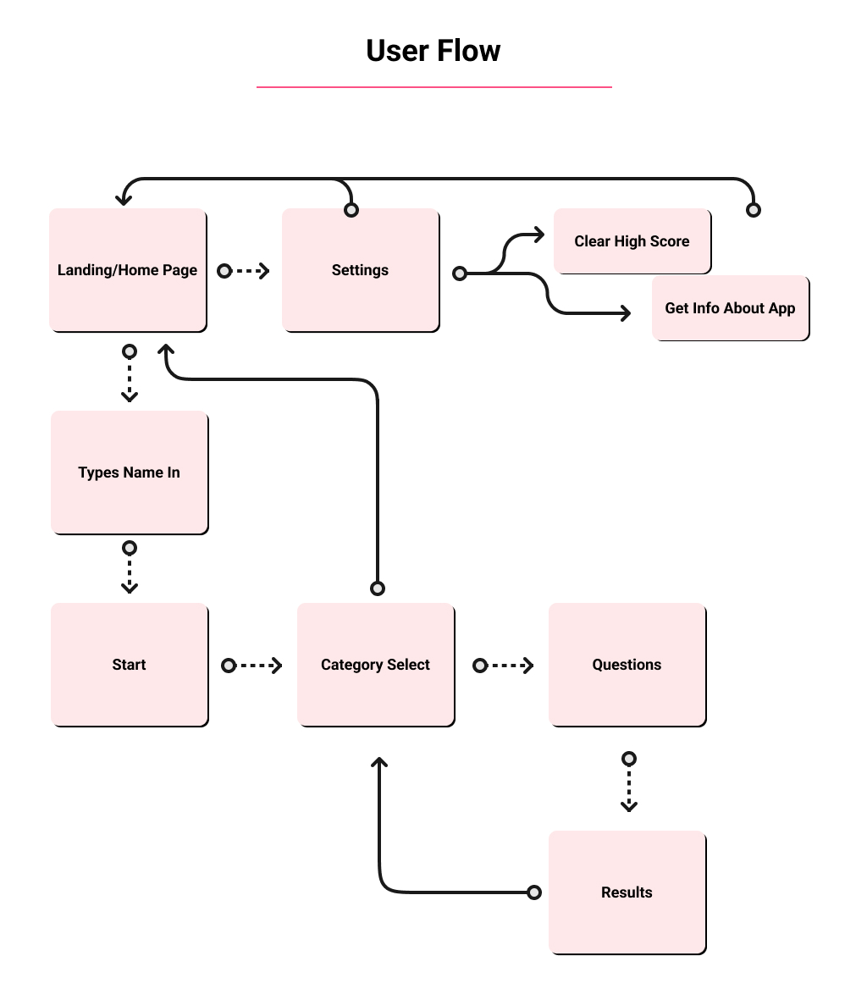
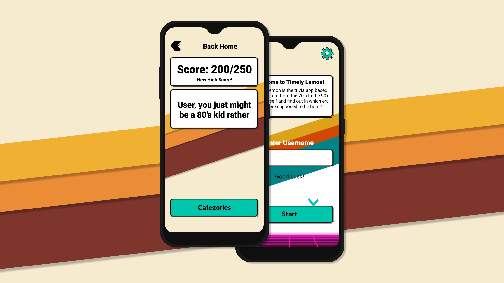
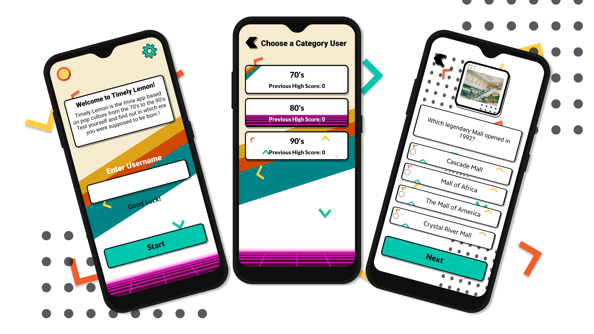
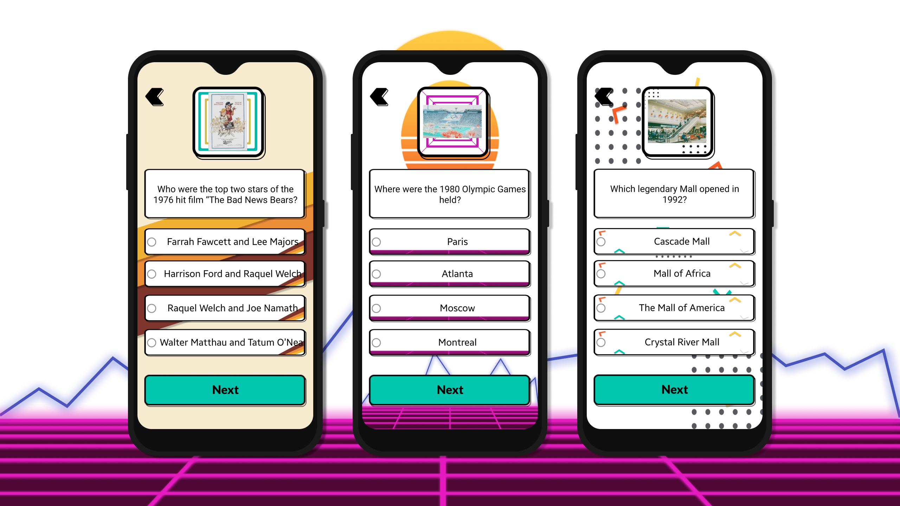
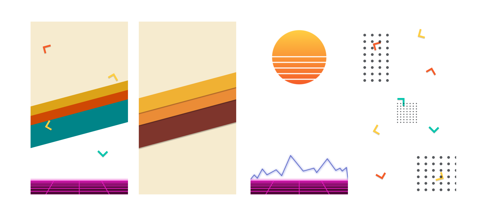

## Repo Info


Reinhardt de Beer
21100115 - DV_202_V2

# TimelyLemon - Android Term 3
<p align="center">
    
</p>

Timely Lemon is a trivia android app developed in Android Studio using Kotlin. This trivia app is based on pop culture from the 70's to the 90's. Based on your score you'll find out in which era you were supposed to be born.

## Table of contents

* [Installation](#Installation)
* [Build With](#Build-With)
* [Features](#Features-and-Functions)
* [Development-Process](#Development-Process)
    * [Ideation](#Ideation)
    * [Wireframes](#Wireframes)
    * [Challenges](#Challenges)
* [Final-Outcome](#Final-Outcome)
    * [Mockups](#Mockups)
    * [Wallpapers](#Wallpapers-Link)
    * [Video-Demonstration](#Video-Demonstration)
    * [Final-Outcome](#Final-Outcome)
* [Authors](#Authors)
* [License](#License)
* [Contact](#Contact)
* [Acknowledgements](#Acknowledgements)

## Installation

1. GitHub Desktop
Enter `https://github.com/EpicBlue1/TimelyLemon.git` into the URL field and press the `Clone` button.

2. Clone Repository
Run the following in the command-line to clone the project:
   ```sh
   git clone https://github.com/EpicBlue1/TimelyLemon.git
   ```
3. Open `Android Studio` and select `File | Open...` from the menu. Select cloned directory and press `Open` button.

4. No other prerequisites.

## Build With

| Name              | Link                                                                     |
| ----------------- | ------------------------------------------------------------------------ |
| <p align="center"></p> <p align="left">Android Studio</p> |  https://developer.android.com/studio |
| <p align="center"></p> <p align="left">Android Studio</p> |  https://kotlinlang.org/ |

## Features and Functions

- High scores/ Previous scores are saved in storage so they can be viewed even after closing the app.
- High scores can be cleared
- High Score for each category are saved
- Custom UI and animations
- Trivia Questions about 70's 80's and 90's pop culture
- Answer validation
- Responses based on scores and specific category

## Development Process

### Ideation
[Pinterest Board For Concept](https://za.pinterest.com/debeer0072/android_t3_y2/)

### Wireframes
<p align="center">
    
</p>

### User FLow
<p align="center">
    
</p>

## Challenges

* Layout styling inside kotlin is limited (grid, as far as I know, can't be set to span two columns)
* Kotlin is still young, cant find much help online when stuck
* Inconsistencies between the way you style elements

## Final Outcome

### Mockups

<p align="center">
    
    
    
</p>


## Wallpapers Link

Throughout the project I had to create a lot of custom ui and ended up making some nice backgrounds/wallpapers. Feel free to download!

<p align="center">
    
</p>

[Download](https://drive.google.com/file/d/1SwXcHJvZ8XLswMH9NlxUMMFmEw1DMTv7/view?usp=sharing)

## Video Demonstration

To see a run through of the application, click below:

[View Demonstration](https://youtu.be/BsTv7s8KLRI)

## Authors

* **Reinhardt de Beer** - [EpicBlue1](https://github.com/EpicBlue1)

## License

Distributed under the MIT License. See `LICENSE` for more information.

## Contact

* **Reinhardt de Beer** - [21100115@virtualwindow.co.za](mailto:21100115@virtualwindow.co.za) - [@rdb_fotopatat](https://www.instagram.com/rdb_fotopatat/) 
* **Project Link** - https://github.com/EpicBlue1/TimelyLemon

## Acknowledgements

* **70's Trivia Question Ideas** - [Boomagain-70s Trivia](https://boomagain.com/70s-trivia/)
* **80's Trivia Question Ideas** - [Groupgames101-80s Trivia](https://groupgames101.com/90s-trivia-questions/)
* **90's Trivia Question Ideas** - [Groupgames101-90s Trivia](https://boomagain.com/70s-trivia/)
 
